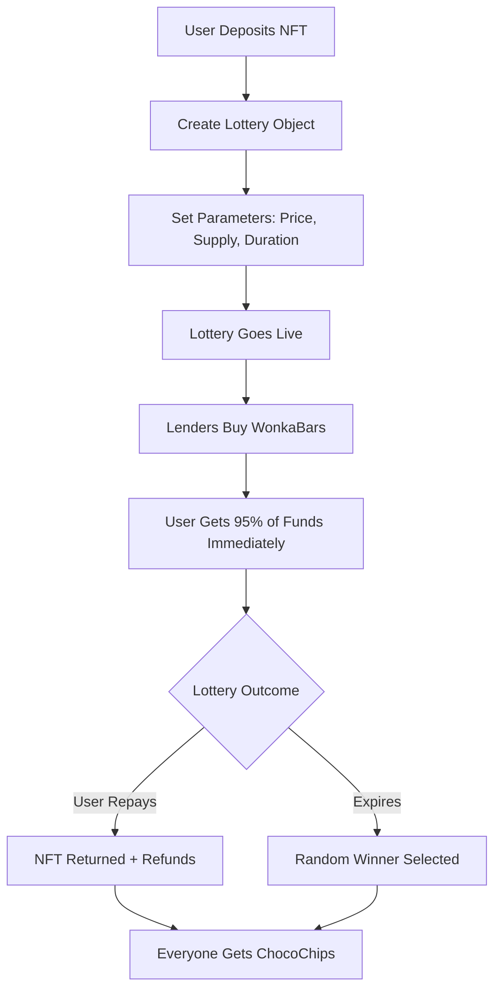

# 🍫 MeltyFi Protocol - Sweet NFT Liquidity on Sui

> **Making the Illiquid Liquid** - Transform your NFTs into instant liquidity through innovative lottery mechanics on Sui blockchain.

[](https://sui.io)
[](https://move-language.github.io)
[](https://nextjs.org)
[](https://opensource.org/licenses/MIT)

## 🎯 **What is MeltyFi?**

MeltyFi is a revolutionary DeFi protocol that solves NFT liquidity through gamified lending. Inspired by Willy Wonka's chocolate factory, our protocol creates win-win scenarios where:

- **NFT Owners** get instant liquidity by creating lotteries with their NFTs as prizes
- **Lenders** fund these lotteries by purchasing "WonkaBars" (lottery tickets) for a chance to win valuable NFTs
- **Everyone** earns ChocoChip rewards regardless of lottery outcomes

### 🏗️ **Protocol Architecture**

```
┌─────────────────┐    ┌─────────────────┐    ┌─────────────────┐
│   NFT Owner     │    │    Lenders      │    │   Protocol      │
│                 │    │                 │    │                 │
│ 1. Deposits NFT │───▶│ 2. Buy WonkaBars│───▶│ 3. Manages      │
│ 2. Gets 95% SUI │◀───│ 3. Get chance   │    │    Lottery      │
│ 3. Can repay to │    │    to win NFT   │    │ 4. Distributes  │
│    reclaim NFT  │    │ 4. Earn CHOC    │    │    rewards      │
└─────────────────┘    └─────────────────┘    └─────────────────┘
```

## 🚀 **Quick Start**

### Prerequisites

- **Node.js** v18 or higher
- **Sui CLI** installed and configured
- **Git** for version control

### Installation

```bash
# Clone the repository
git clone https://github.com/VincenzoImp/MeltyFi.git
cd MeltyFi

# Install all dependencies
npm run install:all

# Set up Sui environment (if needed)
./scripts/sui_setup.sh
```

### Development Setup

```bash
# Build Move contracts
npm run build:contracts

# Run contract tests
npm run test:contracts

# Start frontend development server
npm run dev:frontend

# Full deployment to devnet
npm run deploy:devnet
```

### Environment Configuration

Create `.env` file in the root directory:

```env
# Sui Network Configuration
NEXT_PUBLIC_SUI_NETWORK=devnet
NEXT_PUBLIC_SUI_RPC_URL=https://fullnode.devnet.sui.io:443
SUI_PRIVATE_KEY=your_private_key_here

# Contract Addresses (filled after deployment)
NEXT_PUBLIC_MELTYFI_PACKAGE_ID=0x...
NEXT_PUBLIC_CHOCO_CHIP_TYPE=0x...::choco_chip::CHOCO_CHIP
NEXT_PUBLIC_WONKA_BARS_TYPE=0x...::wonka_bars::WonkaBars

# Application Configuration
NEXT_PUBLIC_APP_NAME=MeltyFi
NEXT_PUBLIC_APP_DESCRIPTION=Making the illiquid liquid
NODE_ENV=development
NEXT_PUBLIC_DEBUG=true
```

## 📚 **Technical Documentation**

### **Smart Contract Architecture**

#### **Core Modules**

1. **`meltyfi_core.move`** - Main protocol logic
   - Lottery creation and management
   - Fund distribution and escrow
   - Winner selection using Sui's randomness
   - Protocol fee collection

2. **`choco_chip.move`** - Governance & Reward Token
   - ERC-20 compatible token on Sui
   - Minting for lottery participants
   - Factory pattern for controlled minting

3. **`wonka_bars.move`** - Lottery Ticket NFTs
   - Non-fungible lottery tickets
   - Batch operations (split/merge)
   - Rich metadata for display

#### **Key Data Structures**

```move
// Core protocol state
struct Protocol has key {
    id: UID,
    admin: address,
    total_lotteries: u64,
    treasury: Balance<SUI>,
    active_lotteries: vector<ID>,
}

// Individual lottery instance
struct Lottery has key {
    id: UID,
    lottery_id: u64,
    owner: address,
    state: u8, // ACTIVE, CANCELLED, CONCLUDED
    expiration_date: u64,
    wonkabar_price: u64,
    max_supply: u64,
    sold_count: u64,
    winner: Option<address>,
    funds: Balance<SUI>,
    participants: Table<address, u64>,
}
```

#### **Protocol Flow**



### **Frontend Architecture**

#### **Technology Stack**
- **Framework**: Next.js 15 with App Router
- **Styling**: Tailwind CSS with custom theme
- **Blockchain**: Sui dApp Kit for wallet integration
- **State**: React Query for server state management
- **UI Components**: Radix UI primitives

#### **Key Components**

```typescript
// Main hook for protocol interaction
const {
  createLottery,     // Create new lottery
  buyWonkaBars,      // Purchase lottery tickets
  redeemWonkaBars,   // Claim winnings/refunds
  lotteries,         // All active lotteries
  userWonkaBars,     // User's tickets
  userBalance,       // SUI balance
} = useMeltyFi()
```

#### **Component Structure**
```
src/
├── app/                    # Next.js app router pages
│   ├── page.tsx           # Landing page
│   ├── lotteries/         # Lottery browsing & creation
│   └── profile/           # User dashboard
├── components/
│   ├── Navigation.tsx     # Main navigation
│   ├── Footer.tsx         # Site footer
│   ├── wallet/            # Wallet connection components
│   └── providers/         # React context providers
├── hooks/
│   └── useMeltyFi.ts     # Main protocol interaction hook
├── constants/
│   └── contracts.ts       # Contract addresses & config
└── types/
    └── lottery.ts         # TypeScript type definitions
```

## 🔧 **Protocol Mechanics**

### **Lottery Creation Process**

1. **NFT Deposit**: User deposits valuable NFT as collateral
2. **Parameter Setting**: 
   - WonkaBar price (minimum bid per ticket)
   - Maximum supply (total tickets available)
   - Duration (lottery lifetime)
3. **Immediate Liquidity**: User receives 95% of potential funds upfront
4. **Listing**: Lottery becomes publicly available

### **WonkaBar Purchase Flow**

1. **Discovery**: Lenders browse active lotteries
2. **Analysis**: Evaluate NFT value vs ticket cost
3. **Purchase**: Buy WonkaBars (1 SUI = 1 ticket minimum)
4. **Tracking**: Monitor lottery progress and odds

### **Lottery Resolution**

#### **Scenario A: Successful Repayment**
- Owner repays loan amount + 5% protocol fee
- NFT returned to owner
- All WonkaBar holders get full refund
- Everyone receives ChocoChip rewards

#### **Scenario B: Lottery Expiration**
- Sui's randomness API selects winner fairly
- Winner receives the NFT
- Non-winners receive ChocoChip consolation rewards
- Owner keeps the borrowed funds

### **Economic Model**

```
Revenue Streams:
├── Protocol Fees (5% of all transactions)
├── ChocoChip Token Utility
└── Premium Features (future)

Token Distribution:
├── 60% - Community Rewards
├── 20% - Team & Development
├── 15% - Ecosystem Growth
└── 5% - Protocol Treasury
```

## 🛡️ **Security Features**

### **Smart Contract Security**
- **Randomness**: Uses Sui's native randomness for fair winner selection
- **Escrow**: Funds held in protocol-controlled accounts
- **Time Locks**: Prevents premature lottery resolution
- **Access Control**: Role-based permissions for admin functions

### **Economic Security**
- **Balanced Incentives**: Win-win mechanics for all participants
- **Protocol Fees**: Sustainable revenue model
- **Slashing Protection**: Penalties for malicious behavior
- **Circuit Breakers**: Emergency stop mechanisms

### **Audit Status**
⚠️ **UNAUDITED**: This is experimental software. Use at your own risk.

## 📊 **Protocol Statistics**

### **Current Metrics** (Mock Data)
- **Total Volume**: 2.4M SUI
- **Active Lotteries**: 47
- **Successful Loans**: 892
- **Community Members**: 3.2K+

### **Performance Indicators**
- **Average Lottery Duration**: 7 days
- **Win Rate**: ~1% per WonkaBar
- **Repayment Rate**: 85%
- **User Satisfaction**: 4.8/5

## 🚀 **Deployment Guide**

### **Automated Deployment**

```bash
# One-command deployment to devnet
./scripts/deployment.sh
```

This script will:
1. ✅ Check prerequisites (Sui CLI, Node.js)
2. ✅ Set up Sui environment and addresses
3. ✅ Install all dependencies
4. ✅ Build and test Move contracts
5. ✅ Deploy contracts to devnet
6. ✅ Update environment variables
7. ✅ Test frontend build

### **Manual Deployment Steps**

```bash
# 1. Build contracts
cd contracts/meltyfi
sui move build

# 2. Run tests
sui move test

# 3. Deploy to network
sui client publish --gas-budget 100000000

# 4. Update frontend configuration
# Copy package ID to .env file

# 5. Build frontend
cd ../../frontend
npm run build
```

### **Deployment Verification**

After deployment, verify:
- [ ] Contracts deployed successfully
- [ ] Package ID updated in frontend
- [ ] Frontend builds without errors
- [ ] Wallet integration works
- [ ] Basic transactions functional

## 🧪 **Testing**

### **Smart Contract Tests**

```bash
# Run all Move tests
npm run test:contracts

# Run specific test module
cd contracts/meltyfi
sui move test --filter meltyfi_tests
```

**Test Coverage:**
- ✅ Lottery creation
- ✅ WonkaBar purchases
- ✅ Winner selection
- ✅ Redemption flows
- ⚠️ Edge cases (limited)

### **Frontend Tests**

```bash
# Run frontend tests
cd frontend
npm test
```

**Test Areas:**
- Component rendering
- Hook functionality
- Type checking
- Build verification

## 🛣️ **Roadmap**

### **Phase 1: Core Protocol** ✅
- [x] Basic lottery mechanics
- [x] NFT collateral system
- [x] WonkaBar ticket system
- [x] ChocoChip rewards

### **Phase 2: Enhanced Features** 🚧
- [ ] Advanced lottery types
- [ ] Cross-collection support
- [ ] Mobile application
- [ ] Enhanced analytics

### **Phase 3: DeFi Integration** 📋
- [ ] Yield farming with ChocoChips
- [ ] NFT price oracles
- [ ] Cross-chain bridges
- [ ] Institutional features

### **Phase 4: Ecosystem** 🔮
- [ ] DAO governance
- [ ] Third-party integrations
- [ ] Developer SDK
- [ ] Educational platform

## 🤝 **Contributing**

We welcome contributions! See our [Contributing Guide](CONTRIBUTING.md) for details.

### **Development Workflow**

1. **Fork** the repository
2. **Create** a feature branch
3. **Make** your changes
4. **Test** thoroughly
5. **Submit** a pull request

### **Code Standards**

- **Move**: Follow Sui Move best practices
- **TypeScript**: Strict type checking enabled
- **Styling**: Consistent Tailwind usage
- **Testing**: Comprehensive test coverage

## 📞 **Support & Community**

### **Get Help**
- 📚 [Documentation](https://docs.meltyfi.com)
- 💬 [Discord Community](https://discord.gg/meltyfi)
- 🐦 [Twitter Updates](https://twitter.com/meltyfi)
- 🐛 [GitHub Issues](https://github.com/VincenzoImp/MeltyFi/issues)

### **Team**
- **Core Development**: MeltyFi Team
- **Smart Contracts**: Sui Move specialists
- **Frontend**: React/Next.js experts
- **Design**: Web3 UX professionals

## ⚖️ **Legal & Disclaimers**

### **License**
This project is licensed under the MIT License. See [LICENSE](LICENSE) for details.

### **Disclaimers**
- **Experimental Software**: Use at your own risk
- **No Financial Advice**: This is not investment advice
- **Beta Software**: Expect bugs and limitations
- **Regulatory Compliance**: Check local laws before using

### **Risk Factors**
- Smart contract bugs
- Economic attack vectors
- Regulatory changes
- Technology limitations

---

## 🍫 **Sweet Success Stories**

> *"MeltyFi helped me unlock 50 SUI from my NFT collection when I needed it most. The lottery mechanism made it fun for everyone involved!"* - **Anonymous User**

> *"I won a rare CryptoPunk through MeltyFi's lottery system. Even when I don't win, the ChocoChip rewards make it worthwhile."* - **Community Member**

---

**Ready to turn your NFTs into liquid gold? Join the sweetest DeFi protocol on Sui!** 🍫✨

[**🚀 Launch App**](https://meltyfi.com) | [**📖 Read Docs**](https://docs.meltyfi.com) | [**💬 Join Discord**](https://discord.gg/meltyfi)